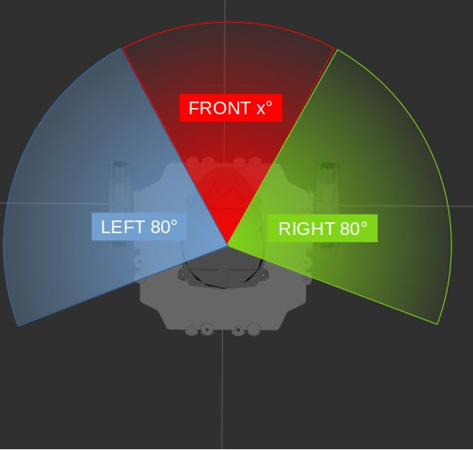
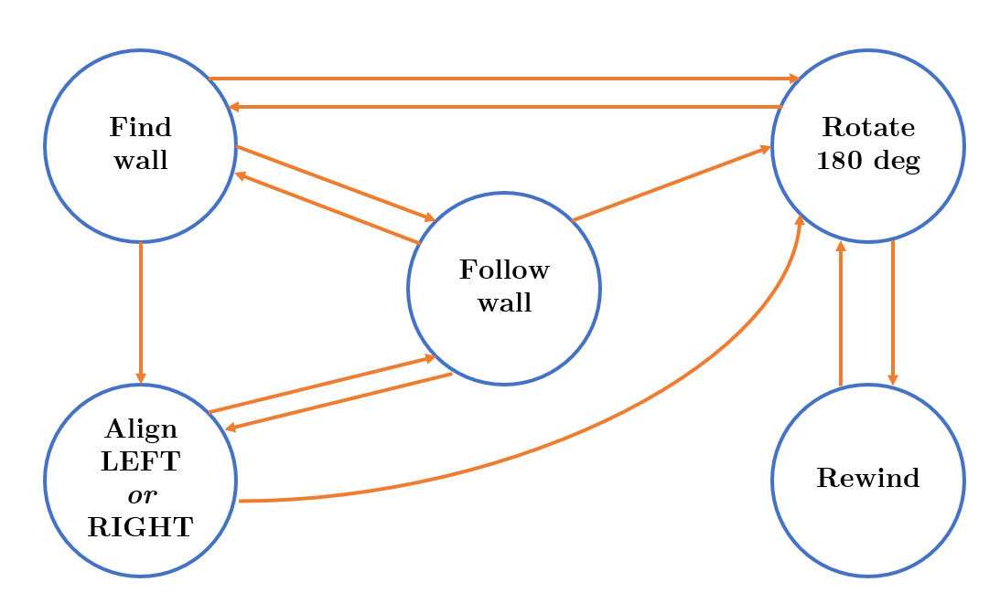
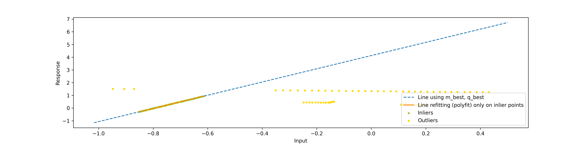
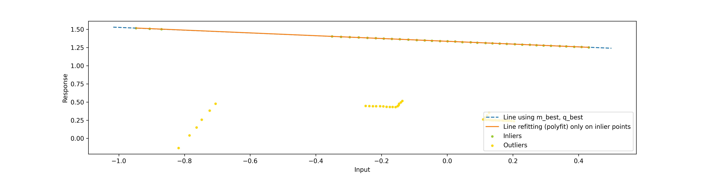

# MobileRoboticsProject

## _How to install the packages in your ROS2 workspace:_
- Refer to the official documentation to install ROS2 Foxy (https://docs.ros.org/en/foxy/Installation.html)
- Copy the "robust_wall_follower", "turtlebot3_description", "turtlebot3_visualizer" packages in your ROS2 workspace (src folder)
- Build and source the workspace
```sh
cd colcon_ws/
colcon build && . install/setup.bash
```

### _Simulation with Unity_
## _To tune the code (optional):_
Modify "robust_wall_follower/robust_wall_follower/robust_wall_follower.py" choosing:

### _SUGGESTED TUNABLE VALUES FOR SIMULATION:_
```sh
- distance_threshold = 0.15   # [m] distance under which the robot detects a wall/obstacle
- front_angle_half = 80       # [°] half width of front region, used to detect and find walls in the surroundings 
- focus_angle_half = 20       # [°] angle width of the front region used in 'align left/right' state
- side_angle = 20             # [°] width of lateral regions 'left' and 'right'  
- ransac_threshold = 0.001    # distance under which a point gives its consensus to a line 
- ransac_iterations = 200     # number of iterations of RANSAC algorithm  
- add_noise = True            # choose whether to add white noise to lidar readings 
- sigma = 0.005               # standard deviation of the optional added white noise 
- K_P = 1                     # controller P term 
- align_max_ang_vel = 0.5     # [rad/s] < 1.82! Maximum angular velocity in 'align left/right' state (saturation) 
```
 
 
 
 
 
 
 
Build and source the workspace


## _How to run it (simulation with Unity):_
- Run Unity and click on the play button (using the "Turtlebot3UnityROS2" map)
- Run the launch file to start Rviz2:
```sh
$ ros2 launch robust_wall_follower robust_wall_follower.launch.py
```
- Run the implemented ROS2 node (choosing the desired align_direction left/right):
```sh
ros2 run robust_wall_follower robust_wall_follower --ros-args -p align_direction:=left
```

### _Real Turtlebot3 Burger robot_

## _To tune the code (optional):_
Modify "robust_wall_follower/robust_wall_follower/robust_wall_follower.py" choosing:

### _SUGGESTED TUNABLE VALUES FOR REAL ROBOT:_
```sh
- distance_threshold = 0.25   # [m] distance under which the robot detects a wall/obstacle
- front_angle_half = 80       # [°] half width of front region, used to detect and find walls in the surroundings 
- focus_angle_half = 20       # [°] angle width of the front region used in 'align left/right' state
- side_angle = 20             # [°] width of lateral regions 'left' and 'right'  
- ransac_threshold = 0.001    # distance under which a point gives its consensus to a line 
- ransac_iterations = 200     # number of iterations of RANSAC algorithm  
- add_noise = False           # choose whether to add white noise to lidar readings (NO need to add noise on the real lidar)
- sigma = 0.005               # standard deviation of the optional added white noise (NOT USED)
- K_P = 1                     # controller P term 
- align_max_ang_vel = 0.5     # [rad/s] < 1.82! Maximum angular velocity in 'align left/right' state (saturation) 
```  
Build and source the workspace


## _How to run it (real Turtlebot3 bringup):_
- Modify "~/.bashrc" file specifying the robot ID and type; in our case:
```sh
export ROS_DOMAIN_ID=34             #TURTLEBOT3; number on the label on the robot!
export TURTLEBOT3_MODEL=burger      #"burger" or "waffle_pi" according to which robot you use
```
- Source "~/.bashrc" file
```sh
source ~/.bashrc
```
- Check that ROS_DOMAIN_ID has been set
```sh
echo $ROS_DOMAIN_ID 
```

- Refer to the official website to perform the bringup (https://emanual.robotis.com/docs/en/platform/turtlebot3/bringup/)


- Run the launch file to start Rviz2:
```sh
$ ros2 launch robust_wall_follower robust_wall_follower.launch.py
```
- Run the implemented ROS2 node (choosing the desired align_direction left/right):
```sh
ros2 run robust_wall_follower robust_wall_follower --ros-args -p align_direction:=left
```


## _About the problem:_
The aim of this project was implementing a robust method for moving precisely aligned to a certain wall. In particular, it was an extention of the "High level control - 1.c" already implemented during laboratory session (see "turtlebot3_HighLevelControl/turtlebot3_HighLevelControl/highLevelControl_Exercise1c_rewind.py" file). What can be clearly seen testing the standard wall follower (both in simulation and on the real robot) is that during the "Follow wall" state, the robot continuously oscillates trying to move straight. This behaviour was obtained imposing an angular velocity that causes the robot to turn towards the wall, avoiding to go away from it. The non-perfect alignment is due to a basic algorithm to perform the task. In that case, the change of state inside the finite state machine depends on the pre-defined regions' amplitudes, as shown by the following picture.

<p align="center">
  
  
</p>

### The following videos (2x speed) show several simulations of the "highLevelControl_Exercise1c_rewind" script:

#### _Align "Left" argument; Simulated robot (Rviz2 and Unity visualizations); WITHOUT noise_
https://user-images.githubusercontent.com/76775232/177986938-8f2c68af-1ee0-4f02-bf9b-f326eca051f2.mp4

#### _Align "Right" argument; Simulated robot (Rviz2 and Unity visualizations); WITHOUT noise_
https://user-images.githubusercontent.com/76775232/177986966-1fff3134-4cc4-4f27-b1c7-e594bc26a8b7.mp4

#### _Align "Left" argument; Simulated robot (Rviz2 and Unity visualizations); WITH noise_
https://user-images.githubusercontent.com/76775232/177987377-43f965f5-ff90-473a-923a-62e733dc80b3.mp4

#### _Align "Right" argument; Simulated robot (Rviz2 and Unity visualizations); WITH noise_
https://user-images.githubusercontent.com/76775232/177987027-ae57e86d-aad5-49d6-8cfa-95cf2768a23c.mp4


In the following image, the implemented Finite State Machine is shown. The algorithm has the ability to perform alignment with respect to the left or right wall. Also, when a key is pressed during the execution, the robot will turn by 180° ("Rotate 180°" state) and enter the "Rewind" state. This state makes the robot "going back" re-running a certain number of linear/angular velocities according to the values stored in a deque stack.
<p align="center">
  
</p>

Some other problems that arise on the real robot are worth mentioning:
- the LIDAR readings are not always in the same quantity. In fact, there's some variability on the length of the structure that contains the measured distances.
- the LIDAR sensor doesn't return 360 values but far less (around 230) each second; moreover the array structure containing the measurements is NOT filled with placeholders that indicate the missing values. This makes the implementation harder, if it relies on regions identified by specific indeces.
- even if the "arena" that we build to contain the robot is taller than the robot itself, several readings refer to outside the walls. In particular, we suppose that this low-cost sensor points the laser "on an angle" with respect to the ground. In fact, the closest measurements are pretty reliable while the distant ones refer to outside the built arena.

## _Our solution:_
This project aims at implementing a robust algorithm to perfectly align to the right/left wall and then go straight until another wall is reached or until a key is pressed (switching to the "Rotate 180 deg" state). This behaviour wasn't achieved by the starting algorithm developed during the lab sessions, as can be clearly seen from the following video (Rviz2 + Unity visualization; the colors of the LIDAR readings match the previously shown regions).

<p align="center">
  
</p>

RANSAC (RANdom SAmple Consensus) algorithm was used in order to achieve robustness. In particular, it was used during the "Align Left/Right" and "Follow wall" states to find a line that approximates at its best (considering only inlier points) the wall direction. That way, the position control algorithm can make the robot follow the computed line.
So, once a wall has been found by the robot looking at a 180° front region, RANSAC is applied on the LIDAR readings to find a line that represents the wall's direction. When the turtlebot is aligned with respect to the wall, it switches to the "Follow wall" state. RANSAC is continuosly applied on a small moving region that stays at the right/left of the turtlebot (depending on align left/right respectively). During this state, the position control loop makes sure that the error, defined as the difference between the estimated angular coefficient and zero (representing a vertical line), is kept as low as possible. This way, the robot stays parallel to the wall thanks to a proportional controller that applies a corrective angular velocity, if needed.

A "multiline" RANSAC algorithm was also implemented but it wasn't actually used during the tests. This is because we found that using a "single line" estimation algorithm, it intrinsecally chose the best line of the two. Meaning that, in a corner situation, the LIDAR readings can refere to two orthogonal lines. But the robot has always to chose one; so estimating a single line, means estimating the one to which more inliers correspond (of course, if RANSAC is properly tuned with a low threshold parameter!).
As an example, a set of points extracted from the LIDAR structure in a corner situation is shown. The "multiline" RANSAC algorithm was applied and the two estimated lines are returned.

<p align="center">
  
  
</p>


Also, the real LIDAR sensor returns noisy measurements. To make fair simulations the code has the ability to add noise to every single LIDAR reading (as can be seen from the video tests). The following image shows the 360° LIDAR visualization with and without noise.

<p align="center">
  
</p>


Some challenges were found during the implementation:
- as mentioned before, the number of LIDAR readings isn't constant and they're far less than 360. So, everything worked in simulation but to extract the right distances (corresponding to the right angles) on the real turtlebot, a mapping was needed. The idea was to fill the missing distances through a simple interpolation process, assuming that the number of "lost" readings was uniform across the 360 degrees. So, for example, if the LIDAR array was long 220, we assumed that the 220th distance corresponded to the 360° angle, while the first to the 0°. Then, all the remaining readings were distributed over the 360° and the remaining ones were computed by interpolation. In the end, no matter what the size of the actual array is, the used LIDAR readings structure has 360 values.
- the LIDAR sensor isn't precise on far measurements and tends to read distances out of the map. This wasn't a big problem because RANSAC considers those points as outliers anyway. To avoid bad visualization on Rviz2, the map's walls were raised though.


#### Align "Right" argument; Real robot on the left and real-time Rviz2 visualization on the right
<p align="center">
  
  
</p>

#### Align "Left" argument; Real robot on the left and real-time Rviz2 visualization on the right
<p align="center">
  
  
</p>

#### Align "Left" argument; Real robot test from above (2x speed)
https://user-images.githubusercontent.com/76775232/177985766-7f591c56-e5a5-4d4e-b149-81ba3bf3fcad.mp4


