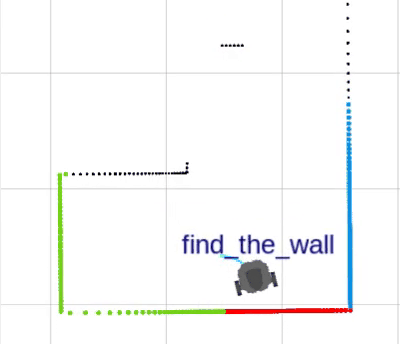
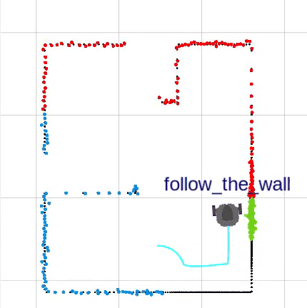
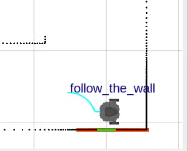
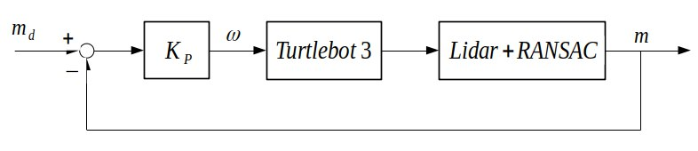

# _Mobile Robotics Project_
##### Authors: Michele Sandrini, Fabio Castellini (univr 2021-2022)
## _How to install the packages in your ROS2 workspace:_
- Refer to the official documentation to install ROS2 Foxy (https://docs.ros.org/en/foxy/Installation.html)
- Refer to the official documentation to install Unity (https://unity3d.com/get-unity/download - https://unity-ros2.readthedocs.io/en/latest/)
- Copy the "robust_wall_follower", "turtlebot3_description", "turtlebot3_visualizer" packages in your ROS2 workspace (src folder)
- Refer to Francesco Trotti's GitLab page to download the used Unity map: https://gitlab.com/TrottiFrancesco/mobile_robotics_lab/-/tree/master/
- Build and source the workspace
```sh
$ cd colcon_ws/
$ colcon build && . install/setup.bash
```


### _Simulation with Unity_
## _To tune the code (optional):_
Modify "robust_wall_follower/robust_wall_follower/robust_wall_follower.py" choosing:

### _SUGGESTED TUNABLE VALUES FOR SIMULATION:_


```sh
- distance_threshold = 0.15   # [m] distance under which the robot detects a wall/obstacle
- front_angle_half = 80       # [°] half width of front region, used to detect and find walls in the surroundings 
- focus_angle_half = 25       # [°] angle width of the front region used in 'align left/right' state
- side_angle = 20             # [°] width of lateral regions 'left' and 'right'  
- ransac_threshold = 0.01     # distance under which a point gives its consensus to a line 
- ransac_iterations = 100     # number of iterations of RANSAC algorithm  
- add_noise = True            # choose whether to add white noise to lidar readings 
- sigma = 0.005               # standard deviation of the optional added white noise 
- K_P = 1                     # controller P term 
- align_max_ang_vel = 0.5     # [rad/s] < 1.82! Maximum angular velocity in 'align left/right' state (saturation) 
```
 
 Build and source the workspace
 


## _How to run it (simulation with Unity):_
- Run Unity and click on the play button (using the "Turtlebot3UnityROS2" map)
- Run the launch file to start Rviz2:
```sh
$ ros2 launch robust_wall_follower robust_wall_follower.launch.py
```
- Run the implemented ROS2 node (choosing the desired align_direction left/right):
```sh
$ ros2 run robust_wall_follower robust_wall_follower --ros-args -p align_direction:=left
```

### _Real Turtlebot3 Burger robot_

## _To tune the code (optional):_
Modify "robust_wall_follower/robust_wall_follower/robust_wall_follower.py" choosing:

### _SUGGESTED TUNABLE VALUES FOR REAL ROBOT:_
```sh
- distance_threshold = 0.25   # [m] distance under which the robot detects a wall/obstacle
- front_angle_half = 80       # [°] half width of front region, used to detect and find walls in the surroundings 
- focus_angle_half = 20       # [°] angle width of the front region used in 'align left/right' state
- side_angle = 20             # [°] width of lateral regions 'left' and 'right'  
- ransac_threshold = 0.001    # distance under which a point gives its consensus to a line 
- ransac_iterations = 200     # number of iterations of RANSAC algorithm  
- add_noise = False           # choose whether to add white noise to lidar readings (NO need to add noise on the real lidar)
- sigma = 0.005               # standard deviation of the optional added white noise (NOT USED)
- K_P = 1                     # controller P term 
- align_max_ang_vel = 0.5     # [rad/s] < 1.82! Maximum angular velocity in 'align left/right' state (saturation) 
```  
Build and source the workspace


## _How to run it (real Turtlebot3 bringup):_
- Modify "~/.bashrc" file specifying the robot ID and type; in our case:
```sh
$ export ROS_DOMAIN_ID=34             #TURTLEBOT3; number on the label on the robot!
$ export TURTLEBOT3_MODEL=burger      #"burger" or "waffle_pi" according to which robot you use
```
- Source "~/.bashrc" file
```sh
$ source ~/.bashrc
```
- Check that ROS_DOMAIN_ID has been set
```sh
$ echo $ROS_DOMAIN_ID 
```

- Refer to the official website to perform the bringup (https://emanual.robotis.com/docs/en/platform/turtlebot3/bringup/)


- Run the launch file to start Rviz2:
```sh
$ ros2 launch robust_wall_follower robust_wall_follower.launch.py
```
- Run the implemented ROS2 node (choosing the desired align_direction left/right):
```sh
$ ros2 run robust_wall_follower robust_wall_follower --ros-args -p align_direction:=left
```

## _How to run the LAB implementation (NOT robust) HighLevelControl_Exercise1c_rewind:_
```sh
$ ros2 launch turtlebot3_HighLevelControl highLevelControl.launch.py
$ ros2 run turtlebot3_HighLevelControl turtlebot3_HighLevelControl_Exercise1c_rewind -- right
```


# About the problem:

---

### OBJECTIVE

The overall **aim** of this project was implementing an algorithm for _moving the Turtlebot3 robot aligned as much as possible to a wall nearby_. 

---


## _Laboratory High Level Control Rewind_

The first try has been done during the laboratory session, where basic algorithm has been implemented in code `turtlebot3_HighLevelControl/turtlebot3_HighLevelControl/highLevelControl_Exercise1c_rewind.py` , named from now for brevity **_Rewind_**.

> To have an intuitive idea of the resulting behavior of the Turtlebot3 in this code, please feel free to look at the section [VIDEOS OF EXPERIMENTS](#rewind:-videos) before starting to read the next WORKING PRINCIPLE and IMPLEMENTATION DETAILS sections.

### _Rewind_: WORKING PRINCIPLE

This code is based on a _basic approach_ which uses a **F**inite **S**tate **M**achine, showed below.

<p align="center">
  
</p>

The robot starts from the state **Find wall**, moving in a certain way until it detects a wall. When this happens, the robot passes to the state **align left/right** (the direction depends on user choice). Here the robot only rotates in place, trying to align to the wall nearby. When the alignment is completed, the robot can move parallel to the wall in **follow wall** state. This motion goes on until either a corner is detected, and robot must align to it (entering again in **align left/right** state), or the wall followed up to that point, ends, and the **find wall** procedure starts again. 

Moreover, there is an extra state: **rewind**. Whenever the user press the key `r`,  the robot enters in the "intermediate" state **rotate 180 deg**, where, as the name suggests, the robot turns of 180°. As soon as this motion is completed, the robot starts the **rewind** procedure, in which it repeats the velocity commands given up to this point, re-executing its past motions, without any sensor feedback. This goes on, until user press key `r`, or the history (implemented with a python [deque](https://docs.python.org/3/library/collections.html)) of previous velocities is empty. After that, **rotate 180 deg** is called again, and then **find wall** routine is resumed. There is actually a third possibility to stop the **rewind** state: that is, the robot gets too close to a wall, risking a collision and so execution is interrupted with an error. This is absolutely possible, since in this state, no sensor information are used, and error in position _integrates_ (accumulates) _over time_!

### _Rewind_: IMPLEMENTATION DETAILS

But how this FSM is implemented? The idea to understand if robot is near and/or aligned to a wall, is based on dividing the LIDAR readings, in regions: **front**, **left** and **right**, like next figure depicts.

<p align="center">
  
  
</p>

> **NOTE:** the LIDAR returns an array of 360 elements. The i-th element content is the distance measured at angle i°, where the 0 index coincides with the forward direction of the Turtlebot3. Indeces increase in counter-clockwise direction.

+ A _wall is detected_ in a certain region, _if the minimum_ distance measurement in this LIDAR region is _lower than_ a certain _threshold_;
+ _robot is aligned to a wall_, if the _lateral region_ measures a distance _under the threshold_, while the _frontal region_ minimum is _over_ this limit (frontal region is obstacles free).

As previously pointed out, this is a simple "naive" algorithm. Lateral **left** or **right** regions, share border with the **front ** region, so they might read very similar distances. This happens when minimum is in proximity of the **front**-**lateral** region's border. Imagine for instance that the robot must align with wall on its right. Turtlebot points towards the wall, at approximately 45° with respect to the surface. In this situation, **front** and **right** regions measure almost the same minimum distance, under the threshold. While robot keeps rotating counter-clockwise, **front** region gets further readings from the wall, so the minimum distance increses. The robot stops, as soon as the minimu distance measured inside **front** region is greater than the threshold. At this points instead, **right** region, which comprise the minimum distance _normal_ line to the wall, measures a value under the threshold.  This is the _trigger_ event, for the FSM edge **align left** &rarr; **follow the wall**.


<p align="center">
  
</p>


> **NOTE**: someone might have noticed that _threshold_ and _angle width_ of **front** region (described with _x°_ in the image) are <ins>crucial parameters</ins>. Slightly modifying them, could dramatically change algorithm performance, and should be tuned carefully to obtain the best results.

### _Rewind_: RESULTS AND DRAWBACKS

Due to the simple approach used by the algorithm, the robot both in simulation and in reality, cannot stay perfectly aligned to the wall. The consequence is an <ins>oscillating behavior</ins> between states. For instance, while exiting a _corner_, since measurements at neighbor regions can vary over and down the threshold, even for really small changes, the robot oscillates from **align left/right** and **follow wall** state.

Or furthermore, another imperfection occurs in _long walls_. Even for really small angular misalignments, Turtlebot can go further or closer to the wall as it moves forward. In the first case, it follows the wall carelessly of going away, until lateral region measures a minimum distance beyond the threshold, and so **find the wall** starts since robot has lost its reference wall.

<p align="center">
  
</p>


The effective results of these issues, are that Turtlebot only approximatively follows walls: its trajectories are actually not straight and not perfectly aligned to walls, like next animation shows. Please focus on the light-blue line representing the trajectory, especially in correspondence of walls, not corners.

<p align="center">
  
</p>


All these cases and others, can be seen in following clips, in which, simulation has been executed with and without _artificial noise_, for a more realistic effect. Please note how noise affects and emphasizes the issues of oscillating state behavior, explained above.

### _Rewind_: VIDEOS

The following videos show several simulations of the `highLevelControl_Exercise1c_rewind.py` script, comparing noisy and noise free measurements:


#### _Align "Left" argument; Simulation (Rviz2 and Unity visualizations) without/with noise (3x speed)_
https://user-images.githubusercontent.com/76775232/178109829-b3948288-71c2-43f1-a1f5-8cf35fa70c1b.mp4


#### _Align "Right" argument; Simulation (Rviz2 and Unity visualizations) without/with noise (3x speed)_
https://user-images.githubusercontent.com/76775232/178110076-e6d31fc9-e86b-47c1-86b1-3139bc285802.mp4

---


# OUR SOLUTION: _Robust wall follower_

This code is actually the project of the course, and it is our attempt solution to solve drawbacks presented above in the laboratory code.

### _Robust wall follower_: OBJECTIVE

The **aim** of the `robust_wall_follower.py` algorithm, is to enhance the `highLevelControl_Exercise1c_rewind.py` presented in previous section and implemented during the laboratory lectures, in order to provide a more _robust and reliable algorithm for following with precision walls_.

### _Robust wall follower_: WORKING PRINCIPLE

The main idea leading this algorithm is based on the **_estimation of a line_**, representing the _wall_ profile, computed _from the LIDAR_ readings. This line, is then used in a feedback loop _to align the Turtlebot3 as precisely as possible parallel to this line_.

### _Robust wall follower_: IMPLEMENTATION DETAILS

##### Line extraction from a set of LIDAR points: RANSAC

The algorithm is based on a Finite State Machine whose states are equivalent to the ones of the _Rewind_ code. However the states **align left/right** and **follow wall** have been completely redesigned, changing consequently also some of the edges of the FSM.

As mentioned before, the main feature of this algorithm, consists in _estimating a line from LIDAR readings_. Please notice that points extracted from the LIDAR, can directly be interpreted as expressed in _POLAR COORDINATES_. The $x$ axis coincides with the forward direction from the robot; the distance from the origin $\rho_i$ is the content of the $i$-th LIDAR element, while $i$ is the angular second component, $\theta_i$ angle in degree from $x$ axis, counter-clockwise positive direction. Hence, from LIDAR can be  almost directly obtained $n=360$  pairs of points $(\rho_i,\theta_i), i=0,...,n=360$, in _POLAR COORDINATES_, that can be easily translated into _CARTESIAN COORDINATES_, obtaining $(x_i,y_i), i=0,...,n=360$ .

At this point, a cloud of points is available, which represents the complete 360° surrounding environment. For instance,  the following image shows the 360° LIDAR visualization with and without noise, in order to make fair simulations.

<p align="center">
  
</p>


However, it is evident from previous image, that it is possible (if not probable) that environment presents several walls. For this reason, it is necessary to reduce the range in which points should be extracted.

But for the moment, let's suppose somehow it was provided to us a set of points, that recall approximately a line. How to extract a line from it?

The answer is the **RANSAC** (RANdom SAmple Consensus) algorithm, which provide robustness, even if a consistent part LIDAR points are actually _outliers_, i.e. they do not belong to the line. In brief, RANSAC, is an iterative method: at each step it takes two random points, computes the equation of the line passing through them, and then uses it for checking for each point of the input set, whether this point is closer than a user defined threshold. If a point is close enough to this line it gives its "consensus" for this line. The process is repeated a set number of times. At the end, the line with the highest number of consensus is kept, together with the points that have given their consensus to it. These forms the so called _inliers_, that are the points that actually (should) belong to this line (as opposed to the _outliers_). In the end, the _inliers_ points, are used to perform a _regression_, obtaining in this way a line, of equation $y = mx + q$, or more precisely its parameters: $m$ the angular coefficient and $q$ the intercept.

This is implemented as a python function in `robust_wall_follower/robust_wall_follower/functions/ransac.py`. 

##### Movable focus region to extract LIDAR points

RANSAC is robust, in sense that it works even with a consistent number of outliers. However if the entire 360-long LIDAR array would be used directly, nothing ensures that the line in which we are interested in, is exactly the one extracted by the algorithm.

Our solution consists in shrinking the LIDAR range taken into account, considering only a restricted region and its relative points. The approach depends on the state:

+ **follow wall**: when robot is following a wall, according to the align direction chosen by user, we can assume a priori that the wall to align with, is relatively either on the right (270° in LIDAR ref. frame) or on the left (90° in LIDAR ref. frame). And so, assuming this angles/indeces, as center of the region and knowing the parameter `focus_angle_half` specifying half width of the angle, the region is defined as:

  + align left: $[270-\text{focus\_angle\_half}, 270+\text{focus\_angle\_half}]$
  + align right: $[90-\text{focus\_angle\_half}, 90+\text{focus\_angle\_half}]$

+ **align left/right**: in this state, the assumption that wall is localized in a specific direction of the lidar, does not hold anymore. The solution found, consists in using a so called **_movable focus region_**. This has still a width of 2*`focus_angle_half` but _its main feature and difference from other regions, is that it is movable_, in the sense that it does not cover a specific fixed fraction of LIDAR (like in case above, since `focus_angle_half` is constant non varying parameter). Its aim indeed, is to always point toward the same wall, regardless of robot motion. In this way, the points extracted are always relative to the same wall, such that robot do not "lose its focus" on its goal of aligning to _that specific_ wall. 

<p align="center">
  
  Focus on green points which belong to the movable focus region
</p>


  For clarity, as an example, suppose that from **find wall**, the robot detects a wall exactly on its front and then passes to **align left**. Initially, assuming `focus_angle_half=20`, the LIDAR points used for RANSAC algorithm lay on range $[-20,20]$ . Then Turtlebot3 starts rotating to align to this wall. After having rotated of 45°, if the region remained the same, the extracted points would not be the initial ones, and nothing ensures that this new set, represents a new wall, or maybe a free area. The region needed, is instead $[-20-45,+20-45] = [-65,-25]$ . Since robot has rotated counter-clockwise, the intial wall will be on its right (negative indeces, points toward right in LIDAR ref. frame).


But how this **_movable focus region_** has been implemented?

To explain this concept, let's start from the initial **find wall** state. At a certain point, a wall in the front region is detected, once again because the minimum measured is under the threshold. The `argmin` of this minimum value, is the direction, in LIDAR reference frame, where the wall is. Indeed minimum distance from wall, coincides with the _perpendicular_ direction to the wall.

1) In code, this initial value is initialized in variable `self.index_init`, and the current robot orientation, estimated by the _odometry_, is stored in `self.angle_init`. (Please pay attention: these two variables might seem the same, but they are not. The first one, is an index in the LIDAR reference frame, while the second one is an angle -in radians-)

   ```
   # Initialization of initial state variables
   self.index_init = argmin( front_region )
   self.angle_init = current robot orientation
   ```

   

2) As next step, supposing left alignment, robot moves to state **align left**. While the robot rotates in place, the _odometry_ measures the different orientation with respect to the initial one, i.e. `self.angle_init`. So, it is possible to measure the _angular displacement_ travelled since the start, which is

   ```
   delta_theta = current robot angle - self.angle_init
   ```

    that should be expressed in degrees, and rounded to integer value

3) Knowing starting wall direction as LIDAR index and the angular displacement since the start of the align motion, then can be computed the _current wall direction_, _expressed as index in LIDAR reference frame_, which is

   ```
   wall_dir_idx_in_lidar = (self.index_init - delta_theta) % 360
   ```

   finally restricted in range $[0, 360]$

4. `wall_dir_idx_in_lidar` is the center of the _movable focus region_, that ranges from $\text{wall\_dir\_idx\_in\_lidar}-\text{focus\_angle\_half}$ to $ \text{wall\_dir\_idx\_in\_lidar}+\text{focus\_angle\_half}$

   

Finally, to recap, this **_movable focus region_** is needed to limit the LIDAR range view used to extract proper points for RANSAC, from which the best regressor line is estimated, obtaining a line equation in shape  $y = mx + q$ , for each step of the ROS node.


> **REMARK**
>
> As alternative method to the **_movable focus region_** , we have implemented a "multiline" RANSAC algorithm, capable of finding two different lines, in the case of corners, but it wasn't actually used during the tests (`robust_wall_follower/robust_wall_follower/functions/ransac.py`, function `my_ransac_multiline`).
>
> As an example, from `ransac_lidar_visualization.ipynb`, a set of points extracted from the LIDAR structure in a corner situation is shown. The "multiline" RANSAC algorithm was applied and the two estimated lines are returned.
>
> 
> <p align="center">
>   
>   
> </p>
> 


##### Control command

Up to this point, a line equation, approximating the wall to which the robot should align with, is available. How to use it to send proper command to Turtlebot3, such that it can precisely be aligned to the wall?

We opted for a feedback loop, schematized in next figure:

<p align="center">
  
</p>


The desired line angular coefficient $m_d$, is in this case  $m_d=0$, since  robot $x$ axis points forward, and when the wall is aligned to Turtlebot3, it appears like a line parallel to the $x$ axis, whose angular coefficient is 0. We can use the current estimated line angular coefficient, $m$, to compute the error $m_d-m$, which should be minimized, using a simple proportional controller $K_P$. The output of the controller is then interpreted as an _angular velocity_ command $\omega$, send in input directly to the Turtlebot3.

This control law, is used both in **align left/right** and **follow wall** states.

> **NOTE:** actually the control law cannot be implemented directly as presented above. This because line angular coefficient, does not provide information on the orientation. Implementing carelessly the above command, would have sometimes aligned the robot with an opposite orientation of 180°. Suppose user has chosen _align left_ and robot points right in front of the wall. If it points slightly on the right, the algorithm based only on the angular coefficient, tries to minimize it, making the robot moving clockwise and ending pointing downwards, with wall on its left (but it should be on the right!). However, in this position the line has anyway $m=0$, and the error $m_d-m=0 \rightarrow \omega=0$ . In this sense, line angular coefficient do not hold information about the orientation: either if the robot is correctly aligned in the right direction or in an opposite direction of 180°, the above control law sees no difference.
> The workaround used in code, consists in using a constant angular velocity, until  `wall_dir_idx_in_lidar`is in certain range, while elsewhere the above proportional control law takes place.


### _Robust wall follower_: RESULTS AND POSSIBLE ENHANCEMENTS

The result obtained completely satisfies the original OBJECTIVE, that is aligning and following with precision a wall, like next section presenting VIDEOS of results prove.

However there are some points in which we think the code could could be improved further:

+ in specific situations, in which really thin walls are faced frontally, the points extracted are not enough, and RANSAC tries to estimate lines, from far walls or worse, finding a line through points which does not describe actually a line
+ the algorithm can be computationally expensive, especially increasing the number of iterations of the RANSAC algorithm, and above all in simulation with Unity. So an optimization work could be useful 


### _Robust wall follower_: SIMULATION VIDEOS


#### _Align "Left" argument; Simulation without/with noise (3x speed)_
https://user-images.githubusercontent.com/76775232/178109214-ddaa892c-1dfb-47c4-b0c1-44e471cc84aa.mp4


#### _Align "Right" argument; Simulation without/with noise (3x speed)_
https://user-images.githubusercontent.com/76775232/178109204-8cbe44bd-60b1-46ac-ab6f-5b91acd29e35.mp4


### _Robust wall follower_: REAL Turtlebot3 VIDEOS

**IMPORTANT REMARKS ABOUT REAL Turtlebot3**

1. **PROBLEM**: **_in real Turtlebot3_** case, the **_array of LIDAR readings_** is not constant and 360 element long, but it **_has variable length_**! For instance, during our tests, we received for each iteration of the control loop, arrays of length from 220 to 240 elements, different for each iteration.
   This can be a serious issue, because, losing the index, means losing the angular coordinate "θ" of the points expressed in _POLAR COORDINATES_! Let's suppose for instance, that LIDAR loses a reading, each three: at the end, the array will be 240 long. This means that the reading relative to angle at index 3, that in Turtlebot3 correspond to 3°, is lost, and the reading of the angle 4°, index 4, takes its place! Going on, until the end of the LIDAR, the reading taken at angle 360°, will be in the array position index 240! And so one reading that should be in forward direction, could seem to be a lateral one! It is clear so, that angular component cannot be considered reliable anymore!
   **SOLUTION**: Our solution, is implemented in`add_lidar_readings `( `functions/auxiliary_functions.py` ). The _**main idea**_ is that, we _assume_ that _LIDAR readings are lost_ at _regular intervals_. So, **_at equally spaced intervals_**, we **_add "artificial" readings_**, computed through _**linear interpolation**_. **_At the end of the process the final length of the array is exactly 360_**.
   **ASSUMPTION**: This method works only under the assumption that LIDAR readings are lost at regular time/angle interval. But the experimental tests, have proved that this hypothesis is well-founded, since the algorithm, thanks to this solution, behaves exactly as desired!

2. Even if in the "arena" that we build to contain the robot, was made of wooden barriers that are slightly taller than the robot itself, several readings went outside the perimeter. In particular, we have noticed that the further the distance measurements, the higher the probability that these readings went above the barriers. On the other hand, points closer to the LIDAR, were usually precise. We suppose the reason is the low-cost LIDAR sensor, whose laser beams might be slightly misaligned with respect to the ground, producing lasers which are not parallel to the plane, but tend to going higher.
   This wasn't a big problem for us, because RANSAC considers usually points coming from close walls to the LIDAR, which are precise and hits the "arena" perimeter, like it is needed.


#### _Align "Left" argument; Real robot test from above (2x speed)_
https://user-images.githubusercontent.com/76775232/177985766-7f591c56-e5a5-4d4e-b149-81ba3bf3fcad.mp4


#### _Align "Right" argument; Real robot on the left and real-time Rviz2 visualization on the right; without/with noise (2x speed)_
<!-- Remove to see gifs
<p align="center">
  
  
</p>
-->
https://user-images.githubusercontent.com/76775232/178110907-1c9569b1-52c8-4221-aa43-b48097e037ff.mp4


#### _Align "Left" argument; Real robot on the left and real-time Rviz2 visualization on the right; without/with noise (2x speed)_
<!-- Remove to see gifs
<p align="center">
  
  
</p>
-->
https://user-images.githubusercontent.com/76775232/178110934-677341ac-f2a7-402c-9aad-6ea1d0808354.mp4


